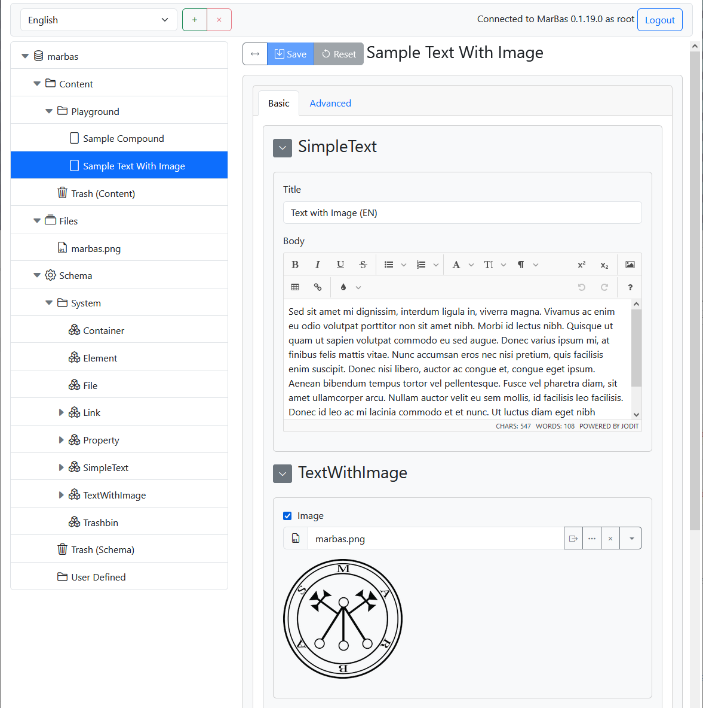

# marbas-silo
 [](/Crafted-Solutions/marbas-silo/releases)

Schema and content management client for [MarBas Databroker](/Crafted-Solutions/marbas-databroker).



## Building
Execute in the project directory
```sh
npm install
npm run build --workspaces
npm run build
```
For development (debug) build execute instead of the last command
```sh
npm run build-dev
```
After build is finished all required files can be found in `dist` directory and can be deployed from there to any HTTP server.

## Running
Execute in the project directory
```sh
npm start
```
The client app runs in development mode at http://localhost:5500/. 